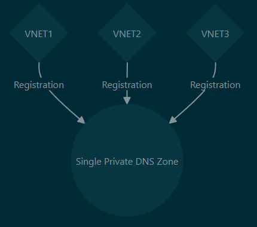
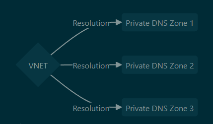
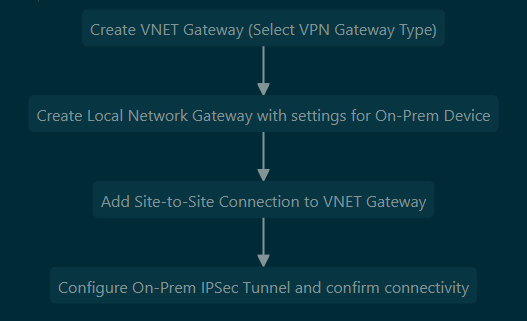
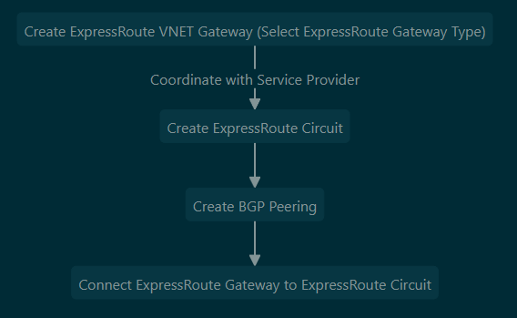
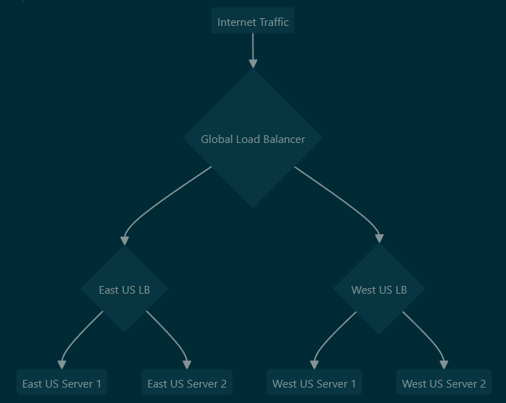
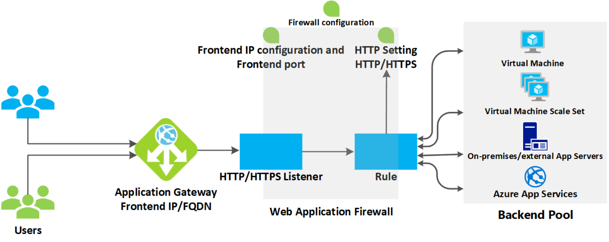

#### Azure Networking Fundamentals

##### Virtual Network (VNET)

- Supernet of network subnets existing in one region only - can be IPv4 RFC1918 or IPv6
- By breaking VNET into subnets, you can assign different routing tables and network security groups to them
- Azure steals 5 IPs from all subnets (Network, Broadcast, Gateway and 2 for DNS)
	- In a /24 these are Network: **.0**, Gateway: **.1**, Azure DNS: **.2-3,** Broadcast: **.255**
- Public IPs are a separate resource that can be assigned to particular vNICs
- VNet peering allows communication of different VNets over the Azure backbone
	- Can also peer between VNETs with VPN network gateway, however this traffic is sent across public internet instead of Microsoft backbone, costs more, has bandwidth limitations and higher hop count
	- The benefit to using VPN network gateways is that they allow for encrypted traffic (VNET peering is unencrypted) and can also peer to on-prem networks
	- If desired, VNET peers can only allow traffic one direction (only from remote/only to remote VNET)
	- IP space must not overlap
	- Unless you use NVAs to broker the connections, VNET peerings do not 'daisy chain' through each other - these peerings are non-transitive
		- e.g. if VNET1 & VNET 3 are peered to VNET2, they can talk to VNET2 but not each other
	- The other exception to this (aside from NVAs) is when connecting to on-prem - this traffic can 'daisy chain' through the VNET connecting to on-prem *if* if you configure the entry VNET to '**AllowGatewayTransit/Use this virtual network's gateway or Route Server**' and the remote VNET to '**UseRemoteGateways/Use the remote virtual network's gateway or Route Server**' for the peering to the entry VNET
	- Since network peering is non-transitive, **hub & spoke** topologies are common in Azure network architecture
	- The hub peers to all spoke VNETs and routes traffic through a central NVA/Azure firewall - this is known as '**service chaining**'
	- This hub & spoke setup is enabled by custom UDR routing traffic to the central NVA/Firewall
- To connect Azure to on-prem, can use S2S VPN (policy-based or route-based VPN) with Azure VPN gateway or to another virtual networking appliance (CSR, etc). Can also use Azure Express Route.

##### Public IPs

- Basic SKU allows all traffic by default and can be dynamically or statically assigned, requires NSG to lock down traffic
- Standard SKU is always static and inaccessible by default, requires NSG to allow access and allows zone redundancy
- Public IPs in Azure are always associated with a private IP

##### Azure Routing

- Software-defined routing - L2 functionally doesn't exist when considering Azure routing as all traffic goes through Azure as the default gateway, not within the same subnet
- Azure automatically populates route tables with system routes to the internet and to the local VNET
- When forwarding traffic through an NVA (**Network Virtual Appliance**), such as a VM firewall or load balancer, the '*IP Forwarding*' checkbox must be enabled on the NIC of the VM. If this is not checked, it will not be able to forward traffic from other devices
	- Another caveat with NVAs - because of the way NICs work in a software-defined network like Azure, adding multiple NICs does not increase performance and can even break symmetric routing
	- Most reference designs for deploying NVAs will only include 1 NIC
- **UDR** - User-defined routes, made by modifying the route table(s) in Azure
- Azure route hop types:
	- **Virtual network** - Routes between subnets/hosts within a VNET
	- **Internet** - Routes to the internet
	- **None** - Null0, dropped traffic
	- **Virtual network gateway** - Used for ExpressRoute and VPNs
	- **Virtual appliance** - Route to an Azure VM used as a network appliance
- For AD, User defined route is preferred, followed by BGP route and lastly by system/default routes
- 'Effective routes' for each VM NIC an easy way to see what routes are actually being used by an appliance
- To force internet traffic to egress over a tunnel to an on-prem location (e.g. to transit an on-prem firewall) a Powershell command is required, `Set-AzVirtualNetworkGatewayDefaultSite`. For traffic going through an Azure NVA to the internet, this is not required - this only comes up if internet traffic is forced over a VPN tunnel.
- **Route Server** - Azure routing resource that simplifies routing between multiple NVAs, useful in more complex routing scenarios
	- Communicates with NVAs over BGP and updates Azure route table, prevents maintenance of many different UDRs to NVAs and can allow connectivity to multiple NVAs without LBs via ECMP
	- One caveat to this is that when using NVAs with a route server, even if you install a specific route for a subnet within a VNET through BGP, Azure will default to sending this traffic directly *within* the VNET. To force this traffic through the firewall you would need a UDR to give it higher AD and force it to be chosen as the preferred route.

##### Route tables

- Azure resource for specifying routes
- By default has some Azure-populated routes to local subnets, the internet for basic connectivity that can be overridden by user routes

##### Public & Private Endpoints

- Azure PaaS services by default route over public internet
- Service endpoints allow connections to Azure PaaS services over Microsoft's private backbone
- Private endpoints & private links work the same, except they also allow access over private connections to on-prem networks, allowing you to completely disable public IPs if desired, and allows you to only connect to a specific instance of a service
- Private endpoints/links are generally a better solution if private access is required to resources
- They work by changing the resolution of a service to a CNAME pointing to '\<service-name>.**privatelink**.windows.net' from the default '\<service-name>.windows.net'
- This 'privatelink' record then resolves to the private IP - DNS resolution required for private endpoints to function
- Private endpoints are currently unaffected by NSGs (they ignore NSG rules)
- Private endpoints are the attachment points into the VNET & subnet, whereas private links are the attachment points into a specific resource (Storage account, for example) - both are required for private connectivity to a resource
- One private link can connect to multiple private endpoints
- Private link **service** (PLS) is different than just a private link itself - this is used for private connectivity to resources in a VNET you do not have access to through peering or site-to-site VPN
	- This can be useful when connecting to vendor resources
	- Must use a standard load balancer - cannot directly attach to other resources than an Azure LB
	- PLS uses its own subnet to source NAT traffic before sending to the front end of the LB

##### Network Watcher

- An Azure feature that allows monitoring and diagnostics of Azure networks, connections to on-prem networks, and displays diagrams of connectivity
- Allows testing of IP flows, viewing next-hops, displays effective security rules, allows packet captures and can be used to troubleshoot connections and VPN gateways

##### Subnet Delegation

- Some services can have subnets delegated to them directly, effectively 'injecting' a managed PaaS service into your VNET
- These may require specific subnet names to function
- They also may or may not allow you to manually use the subnet for other VMs

##### Azure DNS

- **Azure-Provided Default**
	- By default, all private DNS in Azure handled by Azure-provided nameservers automatically
	- Azure 'wireserver' (**168.63.129.16**) handles default name resolution for all VMs
	- Default private DNS always ends with *.internal.cloudapp.net* and are scoped to a single VNET
	- Only accepts queries from Azure resources 
		- To access from on-prem, create DNS server to act as resolver in Azure and conditionally forward to that which can then forward to the wireserver *or* use Azure DNS Private Resolver
- **Azure Private DNS**
	- Allows custom DNS suffixes, manual DNS record creation and can resolve across VNETs
	- Global - any region, subscription, VNET, tenant can use a private DNS zone (with right permissions)
	- Can only resolve Azure NS lookups however, cannot resolve on-prem queries without DNS resolver in Azure
	- When overwriting a record with a manual entry, the automatic DNS record is removed
	- A VNET can only automatically register to one private DNS zone, but a single private DNS zone can be used by many different VNETs for registration
	- One VNET can use multiple DNS zones for resolution, just not for registration

- **3rd-Party VM DNS Server**
	- Typical solution, allowing syncing of domains between on-prem and Azure
	- Alternative would be a newer Azure feature '**Azure DNS Private Resolver**'

#### Azure Network Services

##### NAT Gateway
- By default Azure will NAT traffic the public IP associated with a resource (either PIP for a VM or an LB), however resources without a public IP associated will be NATed to an ephemeral public IP provided by Azure
- It's possible to set up a **NAT GW** resource for a specific subnet in Azure - this will NAT all outbound traffic to the same public IP address
- Note that **NAT GW**s are for outbound sessions and don't provide NAT for any inbound connection other than established sessions - that would require an assigned PIP to an LB or the resource itself
- NAT GWs are zonal - it's best to create a NAT GW for each zone you want to support and to assign resources in the same availability zone to the subnet using the NAT GW
	- This means that you would have to organize your subnets by zone, otherwise the NAT GW will not line up with the zone and could go down while the resources in another zone are still live

##### Azure Virtual WAN
- Managed virtual WAN service for an 'easy mode' hub & spoke topology in Azure
- Can incorporate multiple VPN/ER/VNETs and dynamically handles routing
- All of the functionality of Azure Virtual WAN can be provided without it, but it adds easier management to things like peering many VNETs/ERs/Network Gateways, adding/updating route tables and integrating with NVAs to update routes
- Essentially functions as a hub VNET in a normal hub & spoke topology but with additional management features layered on
- Also allows transitive networking directly between spoke VNETs (not possible with traditional self-managed hub & spoke Azure topology, traffic must go through hub)
- When creating a virtual hub, address space must be allocated for routing between the subnets that will be connected to the hub - the Microsoft recommended subnet size is /23, though it defaults to /16
- Azure Virtual WAN hub has its own route table
	- All VNETs added to hub can associate (learn routes) or propagate (add routes) to/from the Azure Virtual WAN
- You can define custom routes within the Azure Virtual WAN hub - by default all VNETs can talk to all other VNETs in the WAN, but this can be restricted with custom routes
- Hybrid network connections (S2S, P2S VPN, ER) are made directly through hub appliance
- These connections are assigned gateway 'scale units', which essentially function as SKUs by defining available bandwidth for a connection type
	- Scale units for VPN are 500Mbps per unit, 2Gbps per unit for ER
- Unlike a typical VNET, you cannot simply deploy a VM into a AZ Virtual WAN - if you want an NVA to filter your traffic, it has to be one of the Azure partner products (Zscaler, Checkpoint, or Azure firewall)
- When creating multiple hubs within a single Virtual WAN, the hubs automatically have connectivity to each other with no added configuration
- SKUs are '**Basic**' (provides connectivity only for site-to-site connections) or '**Standard**' (provides connectivity for ER, P2S, VNET to VNET, Azure NVA/Azure firewall)

#### Azure VPNs/On-Prem Connectivity

##### VNET Gateway (Virtual Network Gateway/VPN Gateway)
- Used for IPSec connectivity to on-prem (or other VNETs) - available in many SKUs with options for different throughputs, tunnel amounts, zone redundancy options and BGP support - also used for ExpressRoute (covered later)
- Requires its own dedicated subnet named 'GatewaySubnet', typically /27
- Only one VPN gateway and one ExpressRoute gateway possible per each VNET
- With anything other than the 'Basic' SKU, you can change your SKU to cheaper/more expensive options without requiring a redeployment of the resource
- Consists of 2 managed VMs in the background, though this is transparent to the Azure user
- By default, operates in active-standby HA configuration, but this can be configured as active-active instead if desired
- When connecting to on-prem (not another VNET) an additional resource is required, '**Local Network Gateway**' which is used to configure details of the remote network
- Multiple tunnels can be formed to one VPN gateway, but all will share the same throughput limitations on the SKU selected
- Supports both policy-based (legacy, only in Basic SKU) and route-based IPSec VPN types
- VPN routes are automatically added to VNETs when adding a new VNET-to-VNET gateway connection
- **Basic SKU** VPN gateways are **now deprecated** and can only be created via CLI
- Site to Site VPN Basic Setup Process:

##### Point to Site VPN (Client VPN)
- Used to connect to a single computer as opposed to a site-to-site VPN, used for telecommuting to Azure
- Tunnel protocol options are OpenVPN, SSTP and IKEv2 - OpenVPN has the widest compatibility
	- SSTP is only available for Windows, IKE for Macintosh
- Auth methods are Cert, Azure AD, RADIUS
- When adding a new peered network to the VNET where the P2S connection is terminated, the P2S configuration must be redownloaded to the client for them to be able to reach the peer
	- This is a pretty significant limitation as it makes it very painful to use this feature if new VNET peerings are regularly created

##### ExpressRoute
- Private site-to-site connection into Azure, alternative to VPN gateway
- Always active-active pair of connections
- Build-in redundancy and very high speed (up to 100Gbps) options available
- Uses BGP for dynamic routing
	- Microsoft publishes BGP communities for services in specific regions that can be used for route manipulation
- Supports BFD for circuit failure detection
- Not encrypted by default, but can be encrypted with MACsec or IPsec
- Can choose billing options of unlimited data in/out, or unlimited inbound and metered outbound
- **Performance SKU**s are 'standard' (1Gbps, 4 circuits), 'high performance' (2Gbps, 8 circuits) and 'ultra performance' (10Gbps, 16 circuits)
- Each ExpressRoute circuit allows 10 virtual networks to link to it with local or standard **service models** - premium allow up to 100 depending on the circuit size (see [here](https://learn.microsoft.com/en-us/azure/expressroute/expressroute-faqs#expressroute-premium))
- Connection models are 'Cloud Exchange Co-Lo', 'Point to Point', 'Any to Any' or 'ExpressRoute Direct' - all go through service providers except for ExpressRoute Direct which connects directly to Microsoft
- Connecting direct to Microsoft can offer much more bandwidth but is also much more expensive
- **Service models** are 'Local', 'Standard', and 'Premium'
	- Local only allows connectivity to a specific region but is much cheaper and allows for use of the unlimited billing model (unlimited in/out)
	- Standard allows connectivity to any region in a larger geopolitical space (EU, North America)
	- Premium allows connectivity to all regions, private connectivity to O365 and use of **Global Reach**, but is more expensive
- **Global Reach** allows connecting through the Microsoft backbone for your own on-prem location, bypassing the typical transit requirements of going through Azure VNETs
- ExpressRoute **FastPath** can allow bypassing the VNET gateway and routing traffic direct to specific VMs, ideal for extreme low latency requirements but requires the Ultra Performance gateway SKU to function
- ExpressRoute Setup Process:

#### Azure Network Security

##### Azure Firewall
- Layer 3-7 stateful cloud-native firewall resource within Azure that integrates with Azure monitoring
- Standard SKU supports DNAT, network and application rule types, threat intelligence, FQDN support, and has built-in HA
- Premium offers the above and also includes IDS/IPS functionality, TLS inspection, web categories and URL filtering
- Must create a subnet called 'AzureFirewallSubnet' with a mask of /26 or larger
- By default FW will SNAT any traffic destined to non-RFC 1918 IPs, however this can be changed
- You can also link a NAT Gateway to the AzureFirewallSubnet and have this handle SNAT for the firewall
- When determining rule precedence, DNAT rules are first, then network rules, then application rules
- DNAT rules are for destination NAT through the firewall, network rules are for basic inbound/outbound 5 tuple filtering and application rules are for filtering traffic based on FQDN
- Rules can be configured as part of RCG (Rule Collection Groups)
- Rules can also be enforced by policy through a separate resource - these resources can also be nested underneath each other as parent and child policies
- Child policies inherit any RCGs from the parent and could add more if desired without affecting the parent policy

##### Web Application Firewall
- WAF is a PaaS firewall for web applications like Application Gateways, Azure Front Doors
- It can be applied directly to resources or via policy to multiple resources, much like Azure firewall
- When applying to an individual resource, it exists under the resource itself, however when creating WAF as a policy it exists as a separate resource that can be applied to multiple of the same resource type (i.e. multiple AGW or multiple Azure front doors, but not both)

##### Network Security Groups
- Basic Azure ACLs, although they are session-based and stateful
- 5 tuple filtering (*source/destination IP/port, protocol \[TCP, UDP]*) but no application awareness
- *Application Security Groups* can be used to easily apply inbound/outbound traffic rules to groups of VMs with similar functions - function like tags for VMs to allow manipulation of traffic within an NSG
- ASGs are applied through the VM resource pane but apply at the NIC level, not to the VM resource
- Can monitor NSGs through flow logs stored in an Azure storage account (in JSON format) or through log analytics workspace
- These flow logs require Network Watcher be enabled for the region and Microsoft.Insights be enabled for the subscription 

#### Azure Load Balancing Services

##### Load Balancer
- Load balances traffic to backend pool of VMs based on specific load balancing algorithms
- L4, operates based on 5-tuple (*source/destination IP/port, protocol \[TCP, UDP]*) but no application awareness
- Health probes ensure load balancers only forward traffic to healthy VMs
- Supports both balancing traffic to VMs and destination NATing directly to individual VMs if desired
- Basic SKU only allows balancing to an availability set, whereas standard has higher uptime requirements and much more flexibility for its backend pools
- Can be used for internal resources with private IP addressing or external with public (cannot be mixed on one LB)
- Each VM can be a member of only one *internal* LB backend pool and one *external* LB backend pool
- Can implement session persistence (sticky sessions) in Azure LBs
- By using HA ports, can load balance to many different ports simultaneously without having to create rules for each individual port (will distribute all flows to backend regardless of port)
	- This is useful in scenarios such as hosting multiple NVA firewalls in a backend pool to balance traffic - the load balancer will automatically ensure traffic is kept stateful with flow symmetry
	- Only works with standard, internal load balancers
- **Floating IP** will allow the backend member to see the destination IP as the front end IP of the load balancer - normally this would be obscured by Azure with the destination appearing as the VM's IP, from the VM's perspective
- Can allocate specific numbers of ports/IPs for outbound connections through the load balancer with outbound rules
- Can load balance globally between multiple regional load balancers by creating an LB, selecting 'global' tier and using the regional LBs as the backend pool - example below

- Note that [only specific home regions](https://learn.microsoft.com/en-us/azure/load-balancer/cross-region-overview#home-regions-in-azure) can be used for a global LB

##### Application Gateway
- An regional Azure L7 HTTP/S load balancer that allows the LB to route traffic based on HTTP headers, URLs and other attributes
	- For multi-region workloads, use Azure Front Door
- Can be used internally or externally
- Can use app service, IPs and FQDNs on backend pool, not just VMs like a regular Azure LB
- Can also use on-prem resources or public IPs, DNS names in backend - all you need is reachability
- Requires a dedicated subnet
- Supports many more advanced ADC features compared to Azure LB; see below for details
- **Standard V1** SKU supports URL-based routing, multi-site hosting, web application firewalls, TLS offloading, session affinity (sticky sessions), custom error pages, and fully private access
- **Standard V2** SKU supports the above but must use a public IP (and optionally private as well), also supports autoscaling, zone redundancy, static VIPs, integration with AKS controllers and Azure Key vault, HTTP/S header rewriting and custom web application firewall rules

##### Azure Front Door
- A global layer 7 load balancer that supports content acceleration and high availability across Microsoft's backbone network, allowing fast connectivity from anywhere on earth - operates in any Azure region
- Uses similar design as AGW with different vernacular - *frontend* is the same, *origin group* = backend pool, *origin* = backend target and *routes* = rules
- A common configuration would be to have application gateways at the regional level in the origin group (backend), globally load balanced by an Azure Front Door instance
- **Classic V1 SKU** supports global layer 7 HTTP/S/2, heath probes, URL-path based routing, multi-site hosting, cookie affinity, SSL offloading, custom domains and URL rewriting/redirection
- **Standard/Premium V2 SKU** allows for all the V1 features along with caching of web solutions on different Azure POPs, CDN optimization, and custom WAF rules
- With Front Door custom domains, you validate domain ownership with a text record in the domain
- If using custom domains, Azure will manage SSL certificates for you

##### Azure Traffic Manager
- Like Azure Front Door, a global load balancer, however it leverages DNS for this traffic distribution
- When a domain used in traffic manager is queried, traffic manager will examine its routing rules and determine which backend target to return to the query - this allows traffic manager to control how traffic is sent to the backend without being inline of the data stream (other than the DNS resolution)
- These rules can select the backend based on many methods, including priority, weight, performance (lowest latency), geographic location, subnet, etc
- Supports health probing on different protocols (HTTP, HTTPS, TCP) and allows specific path configuration, timeout settings
	- You can also disable health probing for an endpoint if desired
- Backends can be internal Azure app services, external IPs/FDQNs or nested (TM within TM), covered below
- Can nest profiles within each other and use a child profile as an endpoint in a parent profile - [Azure doc](https://learn.microsoft.com/en-us/azure/traffic-manager/traffic-manager-nested-profiles)